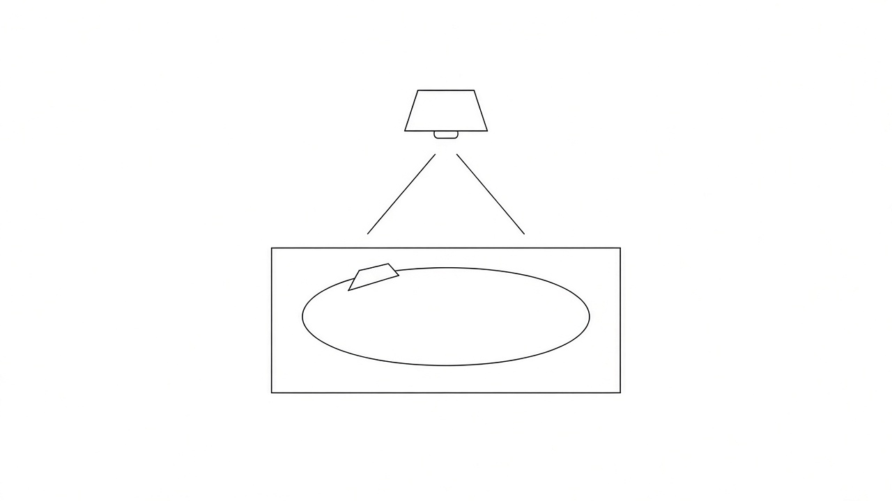
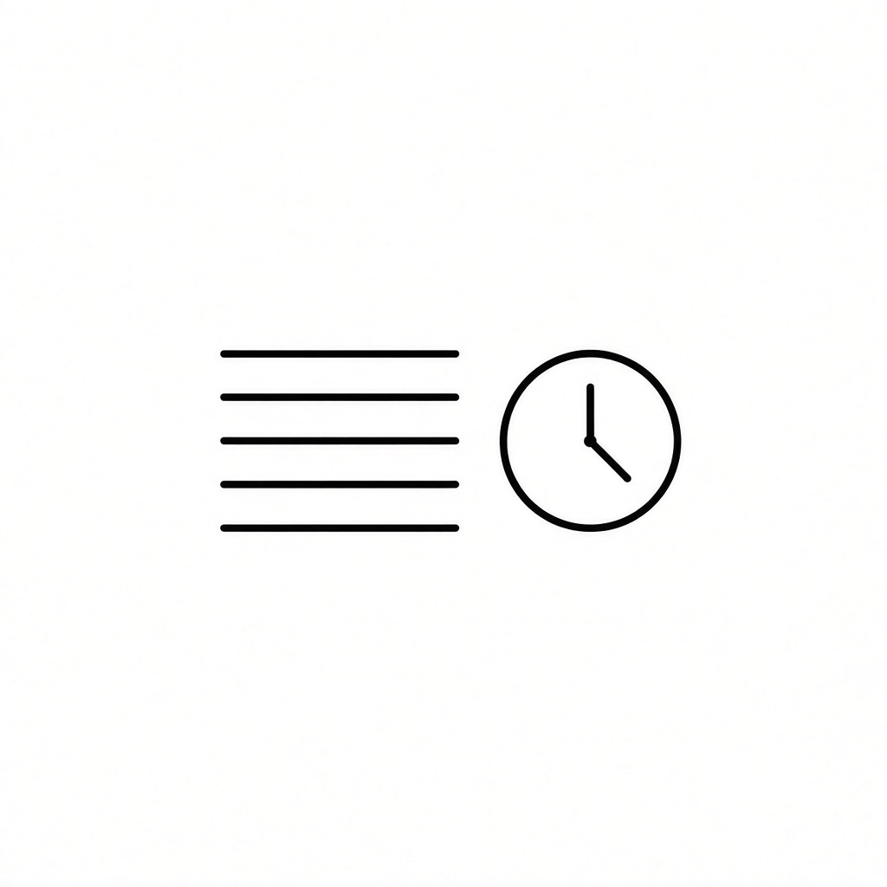

# Manual de juego

Un tapete, carritos de verdad y una pista de luz. El proyector o el teléfono dibujan el circuito sobre la mesa. Los jugadores mueven el auto con el dedo y la app lleva el turno, las zonas y el orden de tiro.

La app no ve el carrito. Ustedes miran la mesa y marcan lo que pasó: un tiro, un foso, un adelantamiento. La luz solo dice dónde está la regla.

## Antes de salir

Hacen falta dos jugadores como mínimo y diez como máximo. Cada uno anota su nombre y el auto con el que corre.

El primero de la lista es el primero de la parrilla. Sale delante y, mientras siga delante, tira primero.

Hay tres largos de carrera:

| Circuito | Vueltas | Para qué sirve |
| --- | --- | --- |
| CIRCUITO | 1 | Una vuelta corta con el reglamento completo |
| GRAN CIRCUITO | 2 | La misma idea, con más exactos, lava y un tramo de lluvia |
| GRAND PRIX | 3 | La carrera larga: dos de casi todo, las tres trampas y lluvia |

Dentro de cada largo hay cinco dibujos de pista: Óvalo, Ocho, Recta, Manzanas y Campeonato. Cada dibujo tiene diez carreras. **SIGUIENTE CARRERA** pasa a la siguiente. Al acabar las diez, abre el dibujo que sigue, en la misma dificultad.

## Cómo se tira

El carrito solo camina con un capirotazo del dedo índice: un toque rápido y seco. No vale empujarlo, arrastrarlo ni irlo acompañando con la mano. Si la mano sigue pegada al carrito, ese tiro no cuenta.

Cada turno trae tres tiros. El botón **¡YA TIRÉ!** anota el que acabas de dar. Cuando se acaban los tres, le toca al que sigue.

Si ya no quieres tirar, **PASAR TURNO** cierra. Los tiros que no usaste no se guardan para después. Se pierden.

Para acomodar el carrito antes de disparar, solo se gira sobre su propio eje, con una llanta pegada a la mesa. Si lo levantas completo, se anula el turno.

## Quién tira primero

Al salir, el primero de la lista va adelante y tira primero. Mientras nadie lo rebase, sigue abriendo cada vuelta de turnos.

Cuando ya tiraron todos, el orden se acomoda a la mesa: tira primero el que va adelante en la pista, luego el segundo y luego los demás.

Si alguien rebasa, en su turno se pulsa **VA PRIMERO**. No se grita nada: ya se sabe que ese jugador abre la siguiente vuelta de turnos. No se mete en el turno que ya iba.

En pantalla se ve el puesto junto al nombre y quién es el 1º de la carrera.

## La línea de gis

La pista es la cinta de gis, del ancho del carril. Tocar la orilla no saca al carrito: mientras siga sobre el gis, ese tiro se quedó y sigue en la carrera.

Cada tiro que se queda deja el carrito en ese lugar, y de ahí sale el siguiente. Tiras el primero. Si se queda, de ahí tiras el segundo. Si el segundo también se queda, de ahí tiras el tercero. Si los tres se quedan, el carrito se queda donde cayó el tercero.

Si un tiro se sale por completo y ya no toca la línea, ese tiro no avanza. El carrito regresa a donde hiciste ese tiro. Si el primero se queda, el segundo se queda y el tercero se sale, el carrito se queda donde hiciste el tercer tiro: el lugar que dejó el segundo. No regresa al inicio del turno.

## Zonas de la pista

Solo se marcan las zonas que esa carrera trae. El botón sale cuando la pista las tiene. Si la carrera no trae esa zona, esa regla no se usa.

**Tiro exacto.** El carrito se detiene en la casilla amarilla y ahí se queda. Si todavía te quedan tiros, puedes seguir desde ese punto. No te regresan ni te castigan: solo clavaste la casilla.

**Tiro largo.** Si el turno se acaba sobre la flecha verde, el siguiente turno de ese jugador trae cuatro tiros, no tres. Es un premio por quedarte en la flecha.

**Trampa de tensión.** Ese tramo se cruza en los tiros que dice la marca: uno, dos o tres, ni uno más ni uno menos. Si el carrito se queda adentro cuando se acaban esos tiros, regresa al inicio de esa sección. No es un foso. El foso te quita el turno que sigue. La trampa te regresa en el mismo tramo.

**Foso.** Es un hueco prohibido. El carrito no puede caer ahí. Si cae, el turno en el que cayó ya se jugó, pero el que sigue se pierde: pasas.

**Lava y hielo.** Si te detienes en esa zona, el turno que sigue lo tiras con la mano con la que no escribes. La luz de lava o de hielo de toda la mesa no cuenta. Solo vale la zona marcada en la pista.

**Lluvia.** Mientras el carrito esté en el tramo azul, ese turno solo tiene un tiro. En el turno que sigue vuelven los tres, salvo que el carrito siga en la lluvia y se marque otra vez. La lluvia de toda la mesa, la del paisaje, no cambia el turno.

**Tráfico.** Si dos carritos quedan pegados, chocados de lado o de frente, un tiro de esa ronda solo sirve para separarlos. El del rival no se mueve.

**Takedown.** Si con un tiro sacas al rival fuera del gis, él pierde el primer tiro de su siguiente turno. Tu carrito se queda donde quedó después del golpe.

**Rebufo.** Si dejas tu carrito justo atrás del rival, a menos de dos centímetros y sin tocarlo, vas en su rebufo. Tu siguiente turno gana un tiro de más.

**VAR.** Si se pelean por la línea o por la meta, se mira con la cámara. Lo que marque la app es lo que vale.

## La luz de la mesa

El proyector tira la pista en color sobre fondo negro, para calcarla con gis.

El paisaje puede seguir el piso:

- Plano: asfalto
- Pendiente: desierto
- Escalones: nieve
- Piso rugoso: bosque

También se puede fijar a mano: lluvia, hielo, nieve, lava, desierto, bosque o noche. Eso cambia el color de la mesa. No cambia el reglamento.

En un televisor se usa el espejo de pantalla del teléfono o del equipo: AirPlay o Chromecast del sistema. La vista de carrera es la que se manda.

## Carrera slot

Es otro modo. Aquí no hay tiros de índice. Hay hasta cuatro carriles, vueltas y tiempo.

1. Se escribe el piloto y el auto de cada carril.
2. **ENTRENO** deja dar vueltas libres y guarda la mejor de cada uno.
3. **CLASIFICACION** ordena la parrilla por esa mejor vuelta.
4. **CARRERA** corre hasta el número de vueltas acordado. Empieza en diez. **− VUELTAS** y **+ VUELTAS** lo cambian.
5. **V1**, **V2**, **V3** y **V4** marcan el paso por meta de cada carril. El primer paso solo arranca el reloj. El siguiente cierra la vuelta, en minutos, segundos y milésimas.
6. Gana quien complete más vueltas. Si van iguales, gana quien cerró antes su última vuelta. Cuando un carril llega al límite, la sesión se cierra.
7. **TORRE** muestra todos los tiempos. **PARRILLA** muestra el orden. **LIDER** agranda al primero.

Cada vuelta, cada récord y el ganador se leen en la pantalla. En el teléfono, la voz del sistema puede decirlos.

El récord queda guardado en esa pista. El resultado de la sesión también.

## Lo que la mesa decide y lo que marca la app

| En la mesa | En la app |
| --- | --- |
| El dedo, el auto y si salió de la línea | El conteo de tiros y el cambio de jugador |
| Quién va delante de verdad | **VA PRIMERO**, para que el siguiente ciclo lo respete |
| Caer en el foso, la lava, el hielo o la lluvia | El castigo de esa zona |
| El paso por meta en el slot | El cronómetro y la clasificación |

Si la luz y la mesa no coinciden, se mira el auto. La app anota lo que ustedes confirman.
