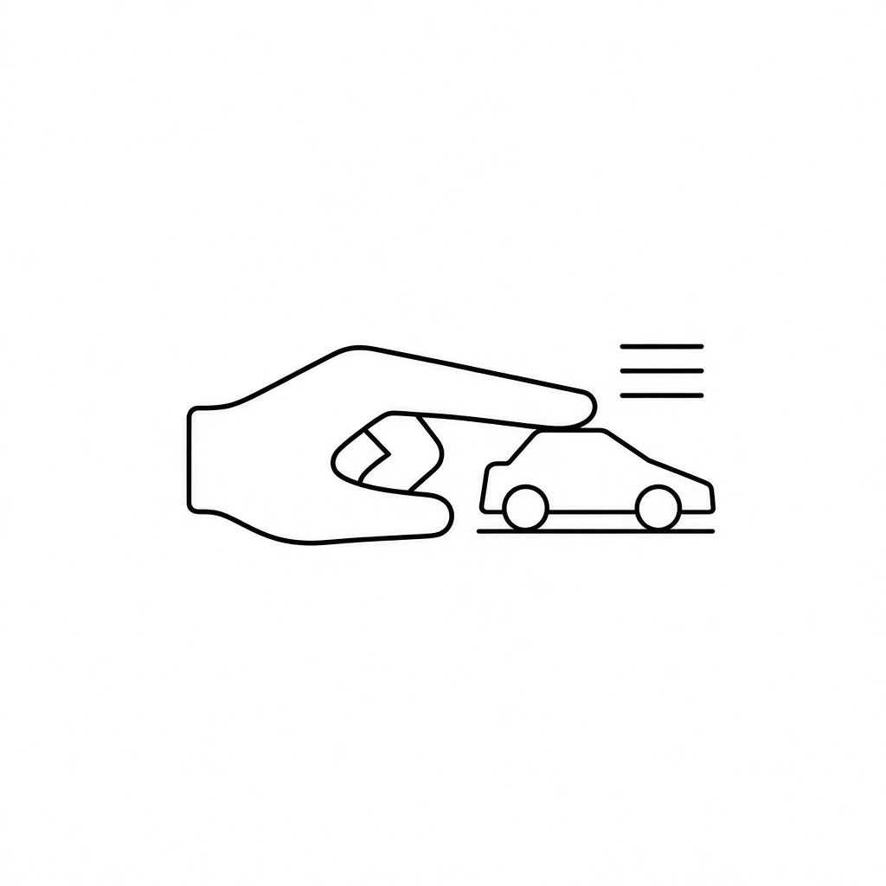
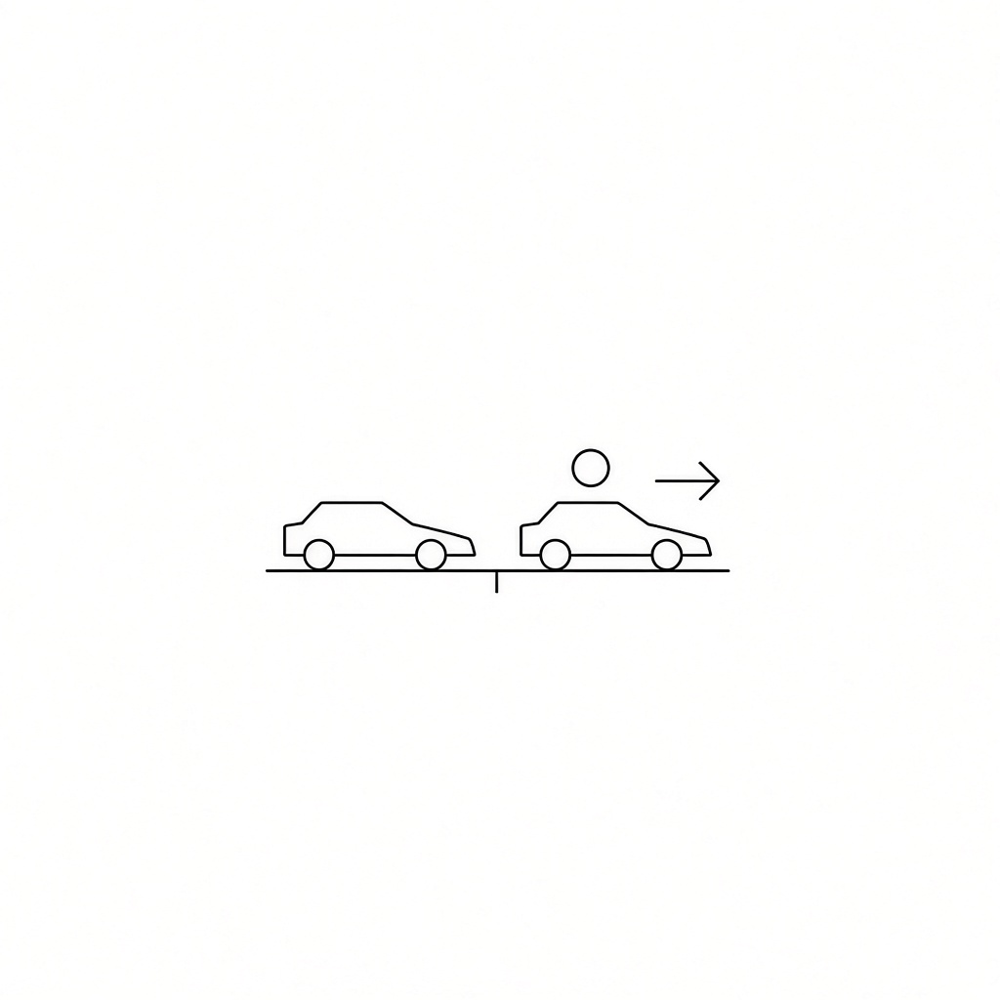
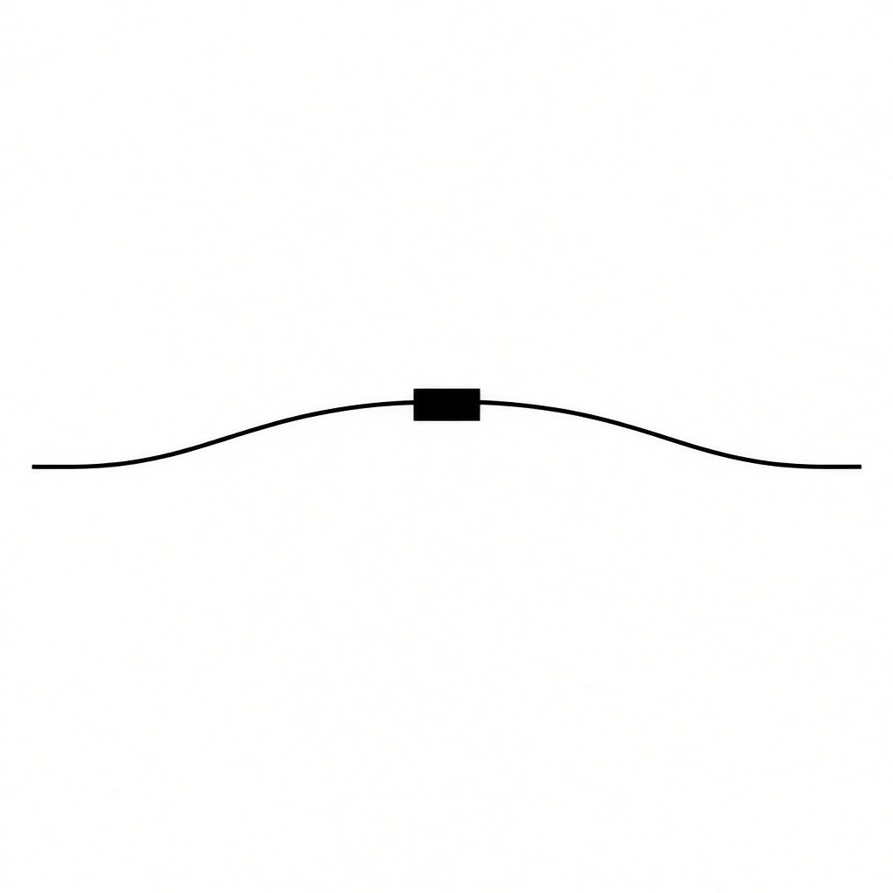

# Reglas básicas

Se juega en la mesa, con carritos de verdad y una pista de gis. Las reglas las cuidan los que están jugando. Si hay duda, se mira el carrito.

## La salida

Juegan de dos a diez. Cada quien corre con su carrito.

El primero de la lista sale adelante y tira primero. Mientras siga adelante, él abre cada vuelta de turnos.

Cuando ya tiraron todos, se mira la pista. Tira primero el que va adelante, luego el segundo, luego el tercero y el resto. Si alguien rebasa, no se grita nada. Ya se sabe que ese va primero en la vuelta de turnos que sigue. No se mete en el turno que ya iba.

## El tiro

El carrito solo camina con un capirotazo del dedo índice, un toque rápido. No se empuja, no se arrastra y no se acompaña con la mano. Si la mano se queda pegada, ese tiro no cuenta.

Cada turno tiene tres tiros. Cuando se acaban, le toca al que sigue.

No hace falta usar los tres. Los que no tires no se guardan para después.

Para acomodar el carrito, solo se gira sobre su propio eje, con una llanta pegada a la mesa. Si lo levantas completo, se anula el turno.

## La línea

La pista es la cinta de gis. Tocar la orilla no saca al carrito: mientras siga sobre el gis, ese tiro se quedó.

Cada tiro que se queda deja el carrito ahí, y de ahí sale el siguiente. Tiras el primero. Si se queda, de ahí tiras el segundo. Si el segundo también se queda, de ahí tiras el tercero. Si los tres se quedan, el carrito se queda donde cayó el tercero.

Si un tiro se sale por completo y ya no toca la línea, ese tiro no avanza. El carrito regresa a donde hiciste ese tiro. Si el primero se queda, el segundo se queda y el tercero se sale, el carrito se queda donde hiciste el tercer tiro: el lugar que dejó el segundo. No regresa al inicio del turno.

## Las zonas

Las zonas se dibujan en la pista. Solo valen las que esa carrera traiga marcadas. Si no está dibujada, esa regla no se usa.

**Turbo.** Si el carrito se detiene en la casilla verde, ese mismo turno gana un tiro de más. Se tira enseguida. No se guarda para después.

**Tiro exacto.** El carrito se detiene en la casilla y ahí se queda. Si todavía le quedan tiros, puede seguir desde ese punto. No es castigo: clavó la casilla.

**Tiro largo.** Si el turno se acaba sobre la flecha, el siguiente turno de ese jugador trae cuatro tiros, no tres.

**Trampa.** Ese tramo se cruza en los tiros que dice la marca: uno, dos o tres. Si el carrito se queda adentro cuando se acaban esos tiros, regresa al inicio de esa sección. No es lo mismo que el foso: el foso te quita el turno que sigue; la trampa te regresa en el mismo tramo.

**Foso.** Es un hueco prohibido. No se puede caer. Si caes, el turno en el que caíste ya se jugó, pero el que sigue se pierde: pasas.

**Lava y hielo.** Si te detienes en esa marca, el turno que sigue lo tiras con la mano con la que no escribes.

**Lluvia.** Mientras el carrito esté en ese tramo, ese turno solo tiene un tiro. En el que sigue vuelven los tres, salvo que siga en la lluvia y se marque otra vez.

**Tráfico.** Si dos carritos quedan pegados, un tiro de esa ronda solo sirve para separarlos. El del rival no se mueve.

**Choque.** Si con un tiro sacas al rival fuera del gis, él pierde el primer tiro de su siguiente turno. Tu carrito se queda donde quedó después del golpe.

**Rebufo.** Si dejas tu carrito justo atrás del rival, a menos de dos centímetros y sin tocarlo, tu siguiente turno gana un tiro de más. Vas en su rebufo.

Si se pelean por la línea o por la meta, se mira el carrito en la mesa. Lo que se ve, vale.

## Las carreras

| Carrera | Vueltas | Qué lleva |
| --- | --- | --- |
| CIRCUITO | 1 | Un tiro exacto, una trampa de un tiro, un foso, un tiro largo, hielo y lluvia |
| GRAN CIRCUITO | 2 | Dos tiros exactos, una trampa de dos tiros, un foso, un tiro largo, lava y lluvia |
| GRAND PRIX | 3 | Dos tiros exactos, trampas de uno, dos y tres tiros, dos fosos, dos tiros largos, lava, hielo y lluvia |

En las tres valen las mismas reglas de siempre: tres tiros, quién tira primero, la línea, el giro, el tráfico, el choque y el rebufo.

Los dibujos de pista son Óvalo, Ocho, Recta, Manzanas y Campeonato. Cada uno se corre diez veces y luego sigue el que viene, en la misma dificultad.
